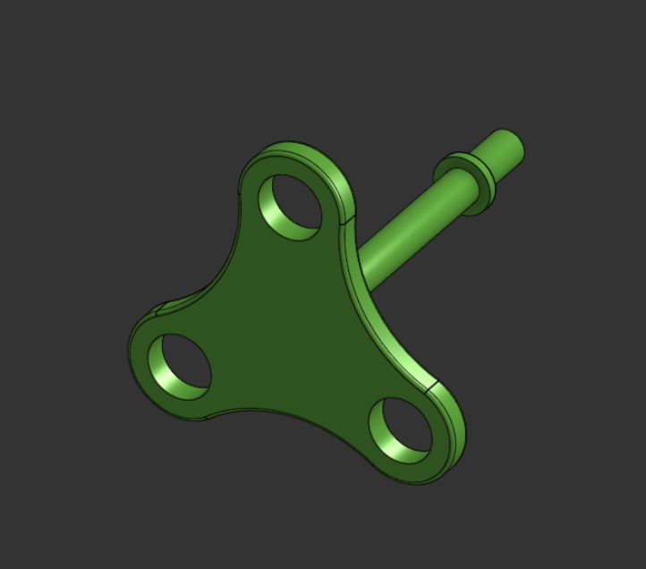
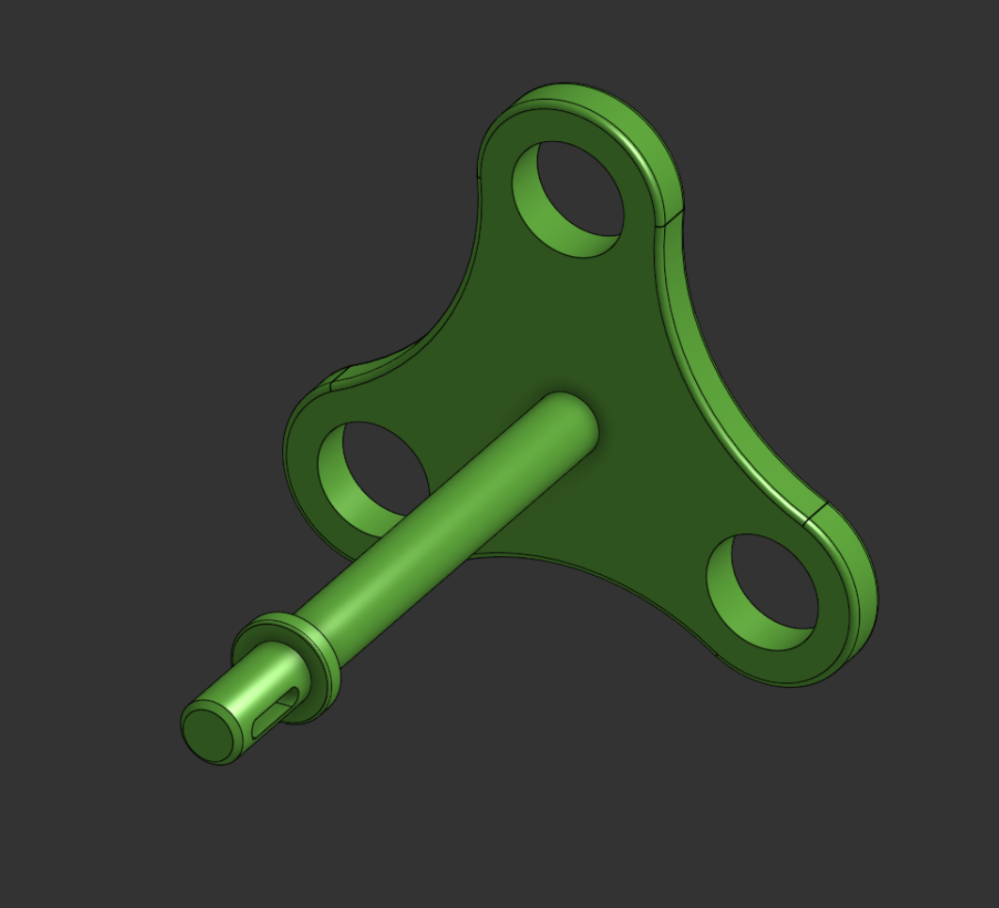
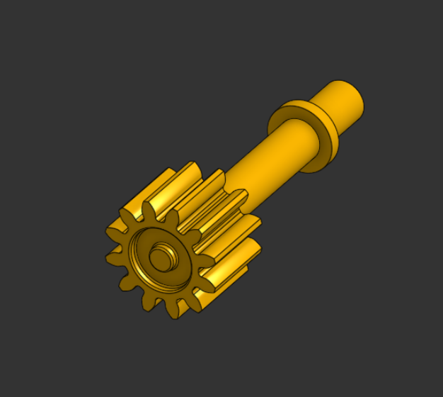
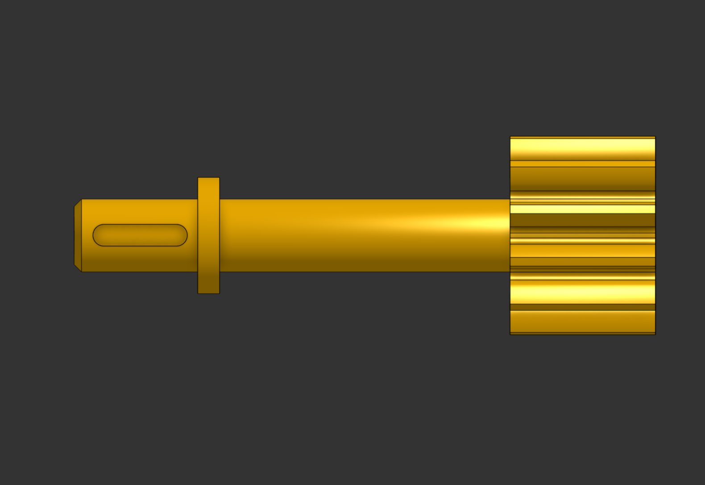
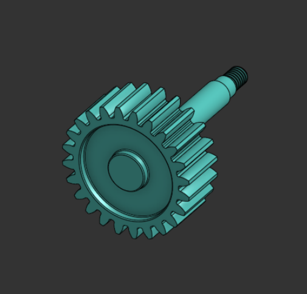
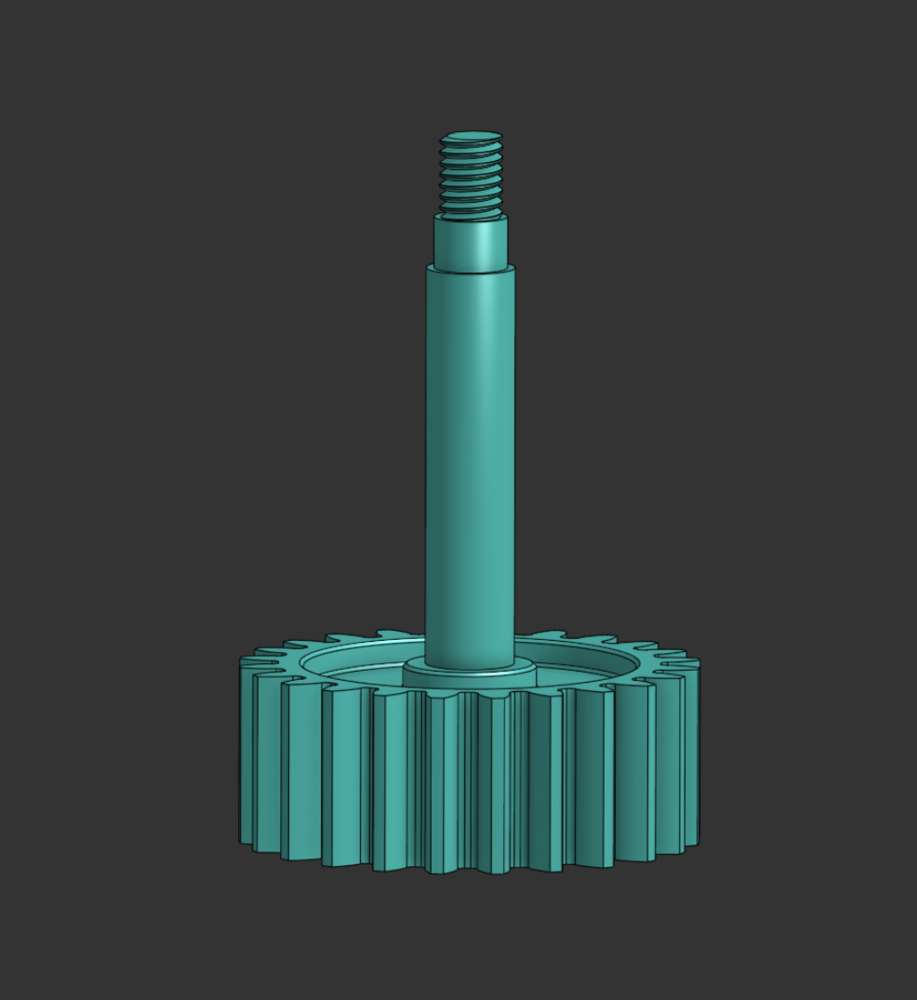
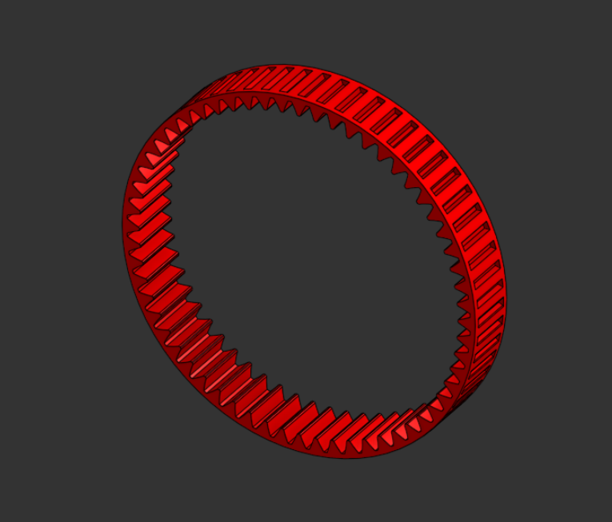
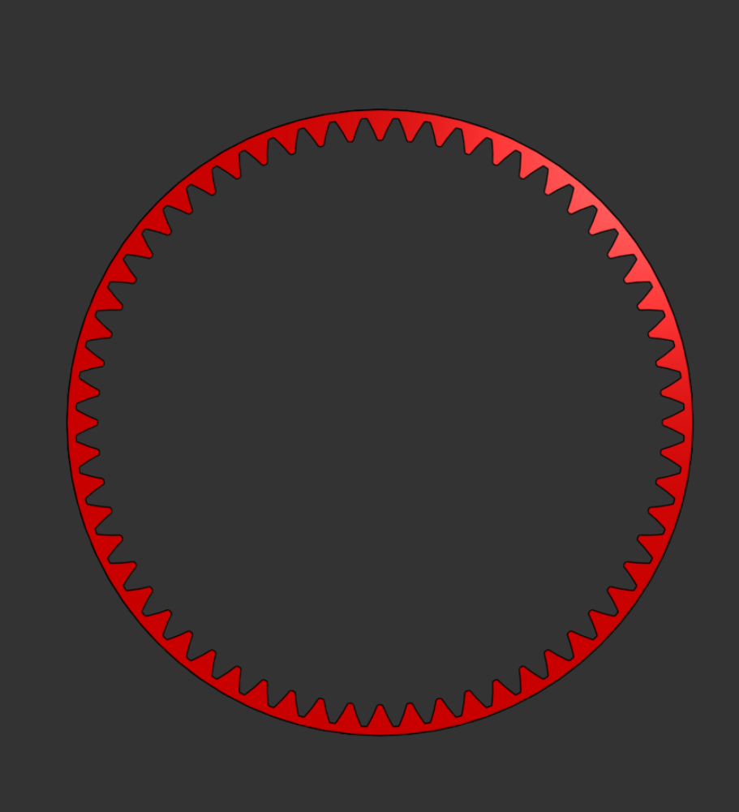
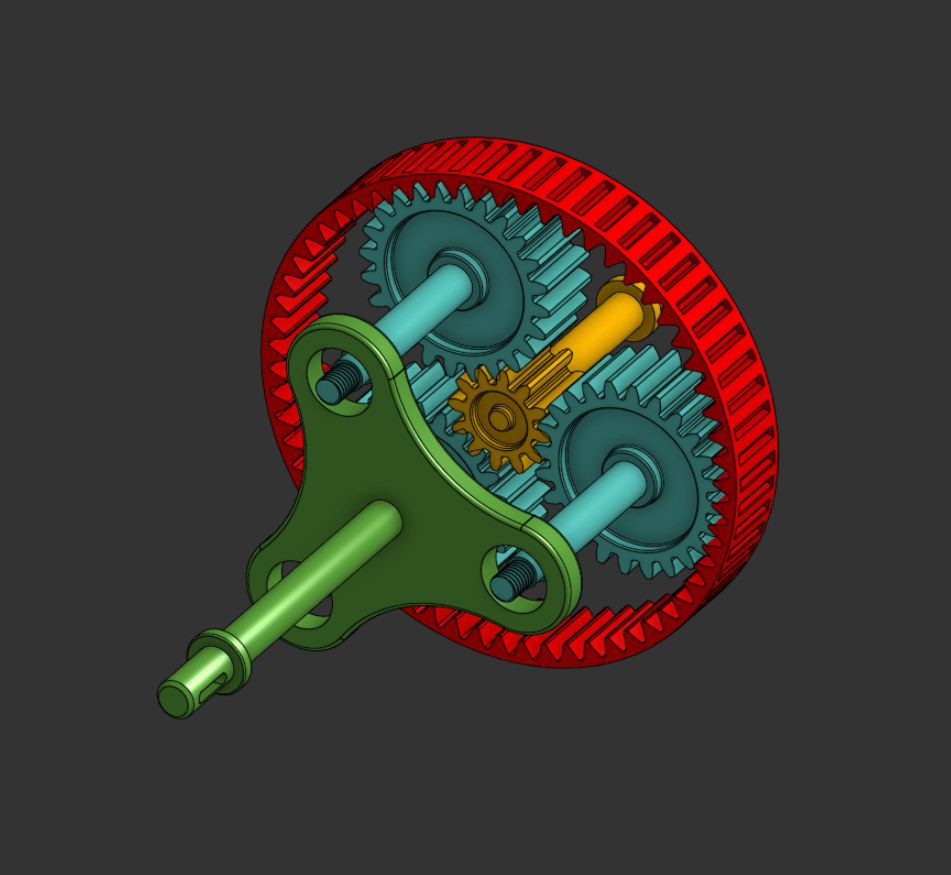
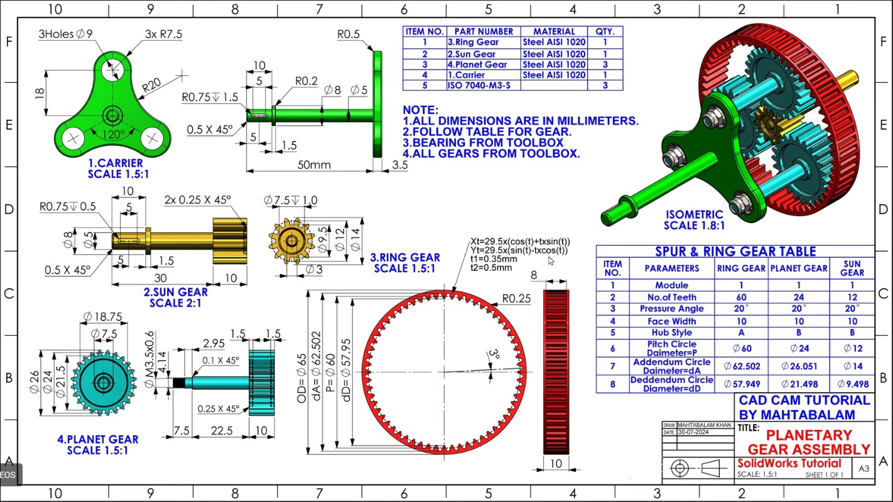

# Planetary Gear Assembly

## Project Overview

This project demonstrates the design and assembly of a planetary gear system modeled in Onshape.

The system consists of:
- Sun Gear
- Three Planet Gears
- Ring Gear (Internal Gear)
- Carrier

All components were modeled individually and then assembled to verify proper meshing and alignment.

---

## Gear Specifications

- Module: 1
- Pressure Angle: 20°
- Ring Gear Teeth: 60
- Planet Gear Teeth: 24
- Sun Gear Teeth: 12

The gear ratio and geometry were selected to ensure proper planetary motion and symmetric distribution of the planet gears.

---

## Components

### Carrier

---

### Sun Gear

---

### Planet Gear

---

### Ring Gear

---

## Full Assembly

---

## Technical Drawing Reference

